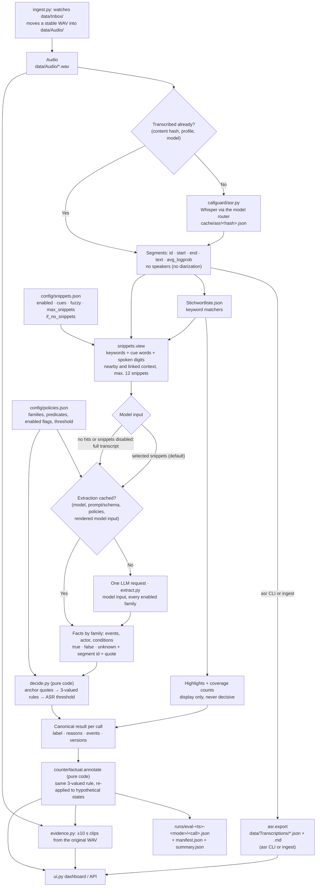
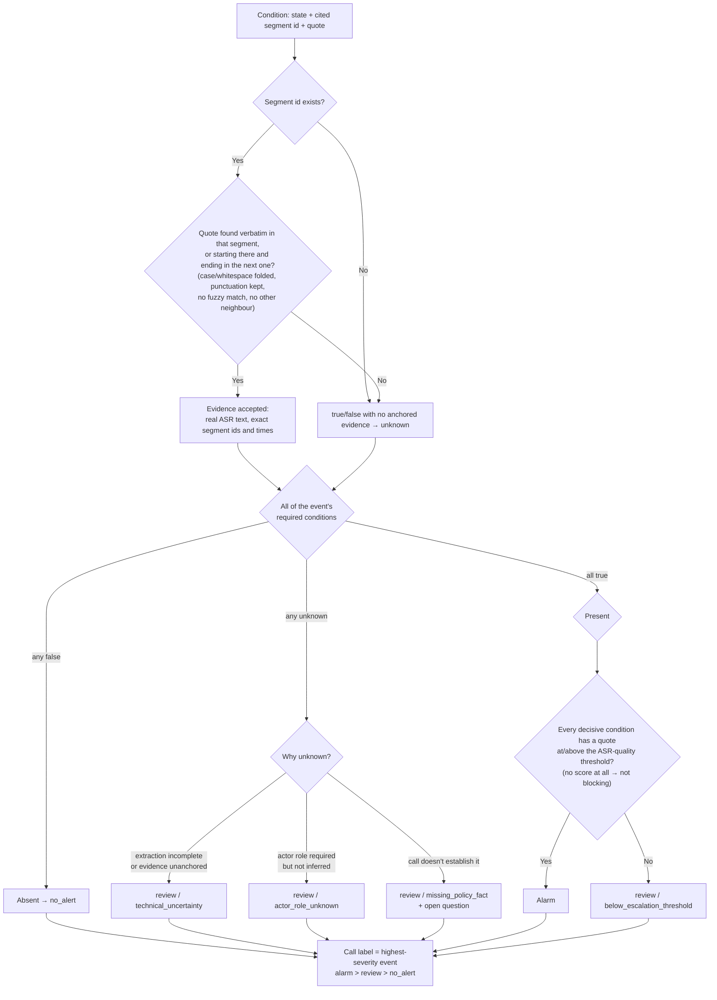
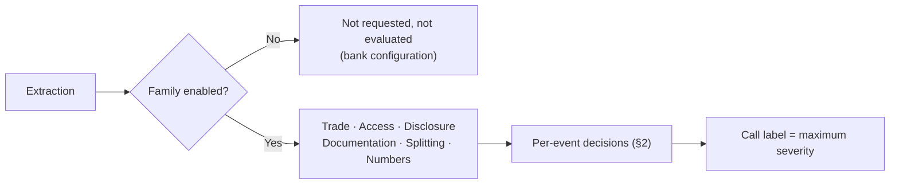
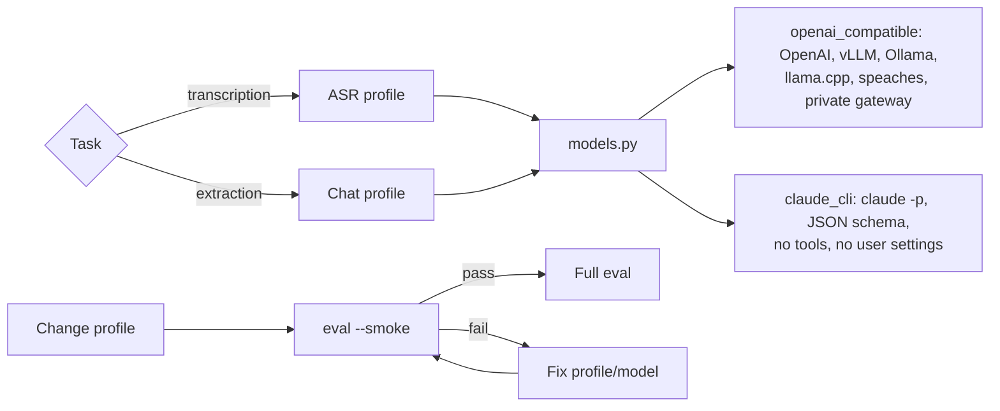
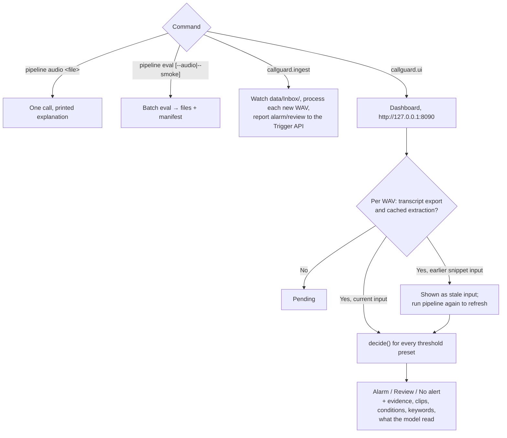

# CallGuard pipeline flow

Diagrams for [`PIPELINE.md`](PIPELINE.md), which has the full explanation. One rule holds everywhere
below: the language model only reports facts with quotations; deterministic code makes every decision.

## 1. End-to-end flow

The default snippet mode deliberately selects what the extraction model reads: keyword, cue-word and
spoken-digit matches add neighbouring and linked-context segments. These signals are **not** evidence and
never directly decide a classification; only quoted transcript text survives grounding and deterministic
rules (§2). With the shipped `if_no_snippets = full_transcript` setting, a call with no selected passage
falls back to the whole transcript; setting `enabled = false` also restores full-transcript extraction.
Every extraction, snippet or full transcript, covers every *enabled* family (§3). A keyword or snippet
configuration change creates a different extraction-cache entry on the next pipeline run.

`ingest.py` is one way a WAV arrives; `pipeline eval --audio` reading `data/Audio/*.wav` directly is the
other — both join at `WAV`. The latter uses the ASR cache but does not itself export
`data/Transcriptions`; run `callguard.asr` or use the watched ingest flow when a dashboard export is
needed.

## 2. Evidence anchoring and decision

Thresholds: `sensitive = 0.50`, `balanced = 0.60` (default), `conservative = 0.75` — an ASR-quality
heuristic, not a fraud probability. A grounding or role failure only touches its own predicate; other
conditions and other events keep deciding independently.

## 3. Policy families

Every enabled family is required in the extraction schema; `"events": []` means "assessed, nothing
found". A bank can switch a whole family off (`policies.json`'s `enabled` flag) — it is then dropped
from the LLM request and treated as absent by configuration, not as a gap.

| Family | Required for an alarm |
|---|---|
| Trade | `own_trade_request`, `information_nonpublic`, `information_market_relevant`, `request_based_on_information` |
| Access | `value_spoken`, `access_secret`, `secret_active` |
| Disclosure | `advisor_disclosed`, `third_party_detail`, `authority_absent` |
| Documentation | `concealment_requested`, `fact_relevant`, `designated_recipient` |
| Splitting | `split_requested`, `movements_connected`, `evasion_purpose` |
| Numbers | none — classified only, never an alarm |

## 4. Model routing

Current profiles: Claude Sonnet 5 (chat) and OpenAI `whisper-1` (ASR) — not self-hostable; every
`eval` run records this in its `manifest.json`. A self-hosted deployment is the same pipeline with
different profiles, gated by the same smoke test.

## 5. Dashboard

The dashboard never calls a model. A threshold switch only reruns `decide()` over cached facts. Saving
the keyword list updates matching, highlights and the *current* snippet view, but does not call a model
or alter the decision derived from an existing cache entry. Instead, an extraction made with the previous
keyword/snippet input is marked `stale_input`; a fresh pipeline run creates and uses the new extraction.
**Pending** means that the transcript export or compatible extraction cache is missing. A failed ASR or
extraction run is recorded by the CLI/ingest result and must be retried; it is never a compliance read.
